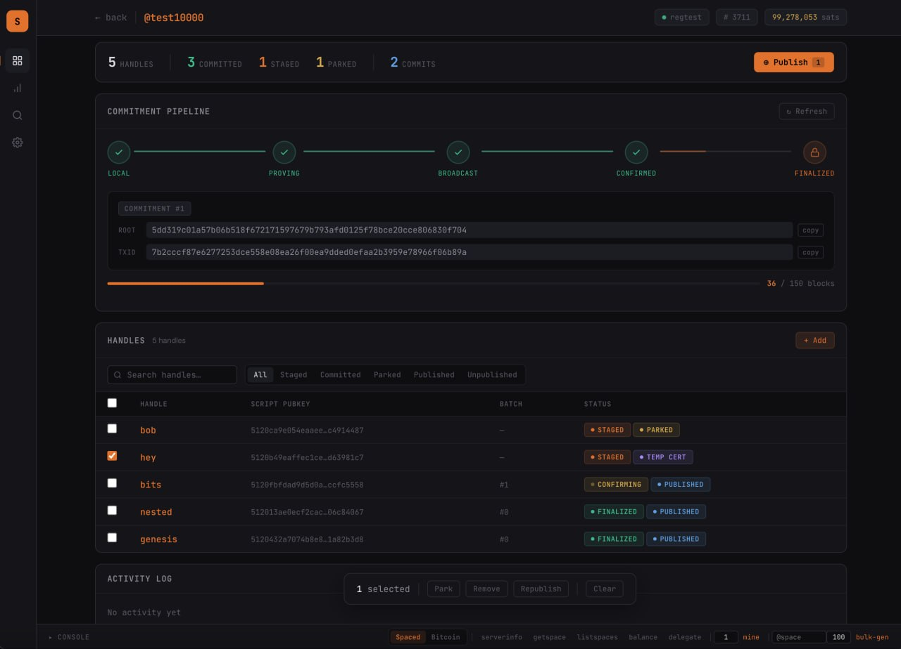

<p align="center">
  <h2>subs</h2>
  <p>
    🟠 <i>create, prove & verify Bitcoin handles off-chain</i>
    <br/>
   </p>
</p>



## How it works

**Basic principle**

1. Add handles to a Merkle tree & commit the 32-byte root to Bitcoin.

2. New handles must prove non-existence in the previous root(s).

3. Subs compresses these proofs: STARK or SNARK → root cert.

4. Owners get an inclusion proof → leaf cert.

5. Certificates are non-revocable: once bound to a script pubkey, it’s yours.

Note: Only the tree root gets committed to Bitcoin - certificates remain off-chain (low footprint!).

See https://spacesprotocol.org/paper


### Who gets to be the operator?

Operators are chosen via permissionless auctions on Bitcoin. They manage top-level spaces: https://explorer.spacesprotocol.org


## Installation

**Prereq (RISC Zero [toolchain](https://dev.risczero.com/api/zkvm/install)):**

```
curl -L https://risczero.com/install | bash
rzup install
```

Install subs:

```
git clone https://github.com/spacesprotocol/subs && cd subs
cargo install --path subs
cargo install --path prover
```

For operators, use `--features cuda` on `subs-prover` for nvidia machines to enable GPU acceleration.

## Usage

### 1. Start the prover server

```
subs-prover --server --server-port 8888
```

### 2. Start subs

Point it at your `spaced` RPC and the wallet that will be used to operate spaces:

```
subs \
  --rpc-url http://127.0.0.1:7225 \
  --wallet my-wallet \
  --data-dir ./data \
  --port 7777
```

Then open http://localhost:7777 in a browser. Under **Settings**, set the prover URL to `http://127.0.0.1:8888` so subs can dispatch proofs.

From the UI you can stage handles, run local commits, broadcast on-chain commitments, and issue / export certificates.

### Test rig (local dev)

The `test-rig` feature spins up a fresh regtest `bitcoind` + `spaced` automatically, so no external setup is needed. Useful for hacking on subs without a live node.

```
cargo install --path subs --features test-rig
subs --test-rig --test-rig-dir ./testrig-data
```

`--wallet` and `--rpc-url` are not required in this mode. The rig persists chain data in `--test-rig-dir` so restarts keep state. The UI exposes an RPC console and a "mine N blocks" helper for driving the chain forward.

## License

Apache 2.0